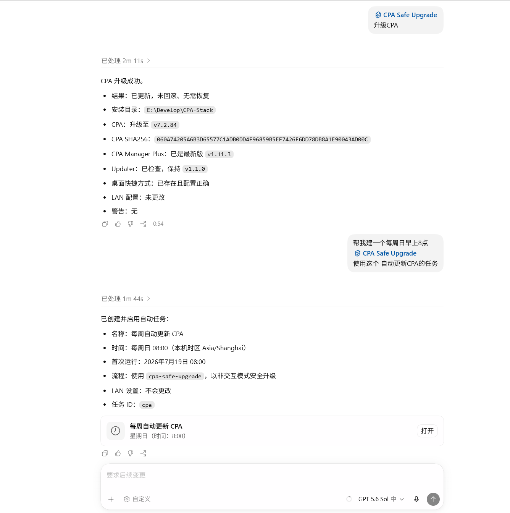
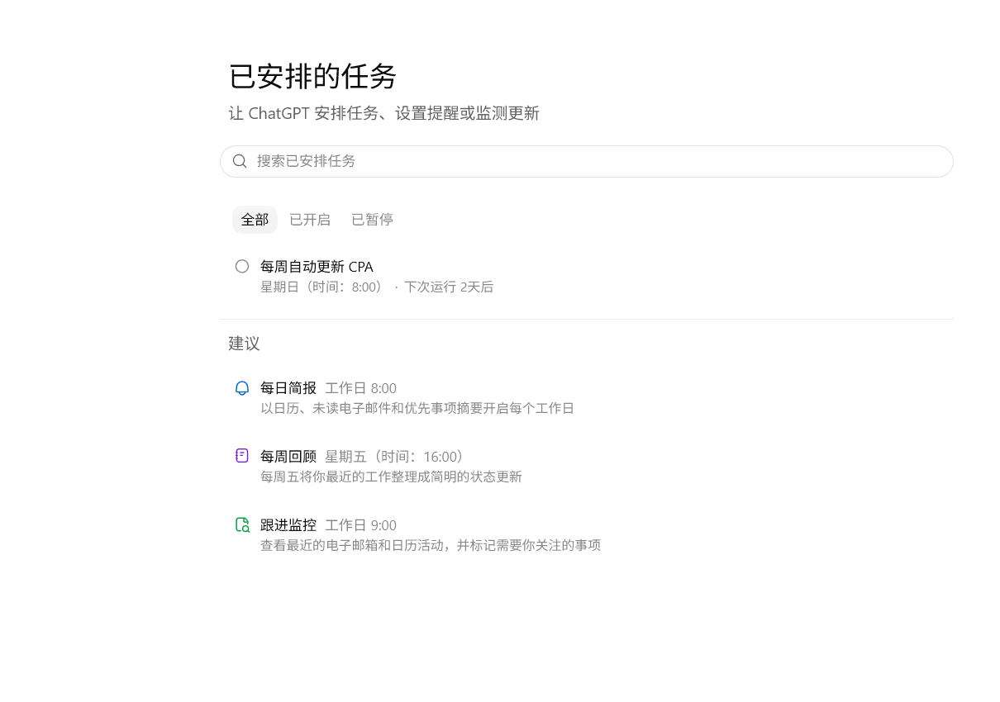
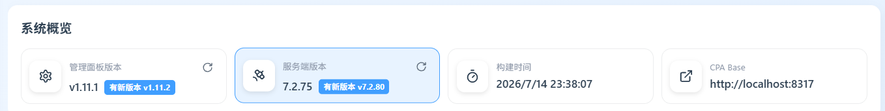
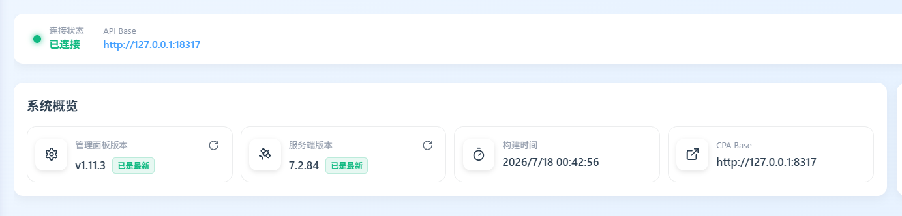
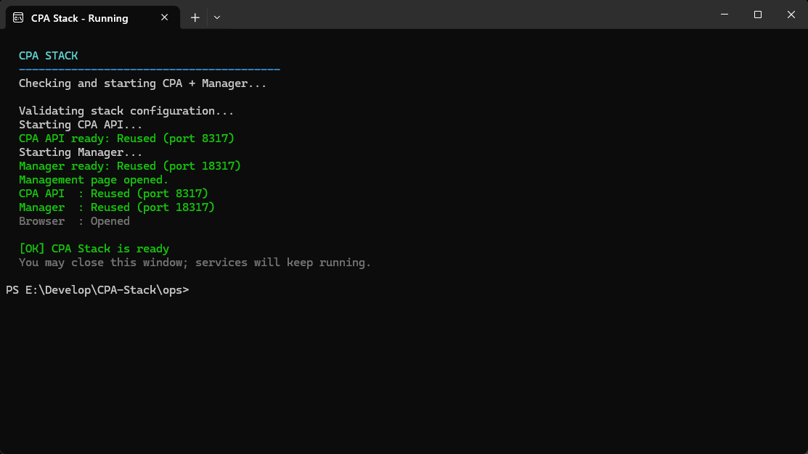

# CPA Stack Updater

[](https://github.com/chrichuang218/cpa-stack-updater/actions/workflows/ci.yml)
[](LICENSE)
[](https://github.com/chrichuang218/cpa-stack-updater)

[English](README.en.md)

面向 Windows 的 CLIProxyAPI/CPA 与 CPA Manager Plus 安全迁移、恢复和升级工具。推荐直接告诉 Codex 你的目标，不需要记 PowerShell 命令；发现、ACL、SQLite 快照、候选验证、切换和回滚由工具自动完成。

> 本项目是社区工具，与两个上游项目不存在官方隶属或背书关系。

## 直接用 Codex

第一次使用时，把仓库地址发给 Codex：

```text
https://github.com/chrichuang218/cpa-stack-updater

帮我安装这个 CPA 升级 Skill，CPA 根目录是 E:\CPA-Stack。
```

安装完成后，下一句话直接说：

```text
使用 $cpa-safe-upgrade 升级 CPA。
```

以后只需说“升级 CPA”“检查 CPA”或“创建 CPA 桌面启动方式”。根目录只在首次安装、切换实例或隔离测试时指定。升级会先验证并更新 Skill，再自动处理恢复、首次迁移、稳定版替换和快捷方式维护，不重复询问；LAN 仍需单独授权。

## 使用截图











## 自动升级会做什么

```text
upgrade
  ├─ updater 有新版 ────────────> 校验、原子更新、用新版重执行
  ├─ 有 pending ────────────────> recover（最多一次）
  ├─ 未建立 canonical stack ────> migrate（最多一次）
  ├─ 已就绪 ────────────────────> upgrade
  └─ 成功后 ────────────────────> shortcut Ensure

lan / start / 手工 Skill installer 均为独立操作
```

用户执行一次 `upgrade` 即授权自动更新 updater，以及必要的恢复、迁移、稳定版替换和默认桌面快捷方式维护。updater 更新失败时不会继续运行旧版本；LAN 仍是独立操作。

## 安全保证

- 候选进程使用动态分配、未占用的高位 loopback 端口；候选端口不是固定用户接口。
- 正式端口来自 managed stack 配置，不假设盘符或端口。
- 只从两个硬编码官方上游读取 Release，并校验 HTTPS、checksum 与 SHA256。
- Skill 自更新只接受本仓库更高的稳定 Release，并验证版本化 ZIP、`checksums.txt`、GitHub 双 digest 与包内 VERSION。
- ZIP 解压前检查路径穿越、文件数量与总大小。
- Manager 数据使用 SQLite online backup，并验证 `quick_check`、必需业务表和历史水位。
- pending journal 绑定 instanceId 且不保存 secret，支持硬中断恢复。
- 停服前固定已验证 listener 的 `Process`；路径/PID 不匹配时绝不终止未知进程。
- 长驻服务无控制台运行，只继承显式指向 `NUL` 的标准句柄。
- managed root、runtime、auth/plugins、Manager data 和关键父目录执行 owner、DACL 与 reparse 检查。
- Windows PowerShell 5.1 路径预算在正式停服前完成。
- 正式切换失败时自动恢复上一健康 runtime；未经授权不删除 legacy 安装或历史目录。
- updater installer 只更新 Skill、稳定 launcher 与 root registration，不升级正式 CPA/Manager，也不改变 LAN。

完整模型见 [docs/safety-model.md](docs/safety-model.md)。

## 要求

- Windows 10/11 x64
- Windows PowerShell 5.1 或 PowerShell 7
- Python 3.10+
- 本地 NTFS 或 ReFS
- 迁移场景下已有 CLIProxyAPI 与 CPA Manager Plus

仓库不包含第三方 exe、真实配置、密钥、数据库或遥测代码。

## 手动安装或更新 Skill（可选）

通常直接使用上面的 Codex 安装话术即可。以下命令只用于手动操作或排障。

从 [Releases](https://github.com/chrichuang218/cpa-stack-updater/releases/latest) 下载并解压可信发行包。先做严格只读检查：

```powershell
powershell.exe -NoProfile -ExecutionPolicy Bypass -File .\install.ps1 `
  -Action Check `
  -StackRoot 'E:\CPA-Stack' `
  -Json
```

确认后原子安装或更新：

```powershell
powershell.exe -NoProfile -ExecutionPolicy Bypass -File .\install.ps1 `
  -Action Update `
  -StackRoot 'E:\CPA-Stack' `
  -Json
```

可用 `-CodexHome` 指定非默认 Codex 目录。安装器采用双槽与受保护 journal；并发 Update 只提交一次，硬中断后再次 Update 会先恢复。显式传入全新的空 `StackRoot` 时，安装器会创建受保护 instance marker 与稳定 launcher，使后续显式 `migrate` 能进入同一 root；它不会安装或启动 CPA runtime。稳定 launcher 写入 `<StackRoot>\ops\Start-CPA-Stack.ps1`，且不会创建桌面快捷方式。

`Bypass` 只作用于本次进程，不修改长期执行策略。安装完成后可删除解压目录。

## 手动运行 CLI（可选）

日常使用不需要这一节。定时任务、脚本集成或排障时再直接调用 CLI。

```powershell
$codexHome = if ($env:CODEX_HOME) { $env:CODEX_HOME } else { Join-Path $HOME '.codex' }
$cpaCli = Join-Path $codexHome 'skills\cpa-safe-upgrade\scripts\cpa-stack.ps1'
$root = 'E:\CPA-Stack'
```

`E:` 只是示例；C、D、E 盘、空格和非 ASCII 路径均可，目标必须通过本地文件系统安全检查。

### 1. 一键升级

```powershell
powershell.exe -NoProfile -ExecutionPolicy Bypass -File $cpaCli upgrade -Root $root -Json
```

命令自动执行 `updater → recover → migrate → runtime upgrade → shortcut Ensure`，不询问二次授权。发现 updater 新版时先安全更新并用新版 CLI 重执行；失败则停止。未知或不可验证的旧 binary 自动替换为已验证的 latest stable；运行时升级成功后自动维护默认桌面快速启动方式。

自动发现不唯一时，可在同一条升级命令中提供 request：

```powershell
powershell.exe -NoProfile -ExecutionPolicy Bypass -File $cpaCli upgrade -Root $root -RequestPath '<request.json>' -Json
```

request 只保存来源路径、secrets 文件路径和可选正式端口，不保存 secret 值。格式见 [migration-request.md](skills/cpa-safe-upgrade/references/migration-request.md)。

真正的安全失败仍会立即停止，包括 journal 歧义、未知端口 owner、不可信 ACL/reparse、checksum、候选健康、磁盘/路径预算、SQLite 水位或自动回滚失败。

#### Windows 定时任务

程序使用 `powershell.exe`，参数使用：

```text
-NoLogo -NoProfile -NonInteractive -ExecutionPolicy Bypass -File "<CodexHome>\skills\cpa-safe-upgrade\scripts\cpa-stack.ps1" upgrade -Root "<managed root>" -Json
```

退出码 `0` 表示 updater/runtime 升级成功或已经最新；非零表示真实失败。命令无 stdin、浏览器或确认提示，下一次调度会自动处理单一可恢复 pending。

### 2. 启动

```powershell
powershell.exe -NoProfile -ExecutionPolicy Bypass -File $cpaCli start -Root $root -NoBrowser
```

`start` 不会隐式恢复 pending transaction。

## 桌面快速启动

`upgrade` 成功后会自动创建或更新当前用户桌面的 `CPA 本地启动.lnk`。你也可以独立执行同一个幂等操作：

```powershell
powershell.exe -NoProfile -ExecutionPolicy Bypass -File $cpaCli shortcut `
  -Action Ensure -Root $root -Json
```

快捷方式使用内置图标，只保留一个可见的 PowerShell 窗口，优先使用 PowerShell 7 (`pwsh.exe`)，未安装时回退 Windows PowerShell 5.1。桌面入口直接运行 Fast starter：不执行 ACL、hash、状态、端口健康或 Manager readiness 预检；已配置进程存在时立即复用，缺失时直接拉起并打开管理页面。完整检查只保留在 CLI `start` 与更新事务中。可识别的旧 CPA 快捷方式会先备份再自动接管；未知无关冲突不会被覆盖。

## LAN 暴露

LAN 是独立高风险操作。解释风险并得到明确授权后才切换：

```powershell
powershell.exe -NoProfile -ExecutionPolicy Bypass -File $cpaCli lan -Action Set -Mode Lan -Root $root -Json
powershell.exe -NoProfile -ExecutionPolicy Bypass -File $cpaCli lan -Action Set -Mode Loopback -Root $root -Json
```

候选验证始终只允许 loopback。

## 结构化返回格式（开发者）

所有公开命令返回统一结构化结果（`schemaVersion=2`）：

```json
{
  "schemaVersion": 2,
  "operation": "upgrade",
  "success": true,
  "outcome": "Changed",
  "changed": true,
  "rolledBack": false,
  "recovered": false,
  "root": "E:\\CPA-Stack",
  "before": null,
  "after": null,
  "warnings": [],
  "error": null,
  "updaterVersion": "1.1.0"
}
```

`error` 非空时稳定包含 `code` 与 `message`。操作专属详情用于诊断；不要依赖未文档化的内部 journal 或动态候选端口。

完整语法见 [docs/cli.md](docs/cli.md)。

## 卸载

```powershell
$uninstaller = Join-Path $codexHome 'skills\cpa-safe-upgrade\scripts\Uninstall-CpaSafeUpgrade.ps1'
powershell.exe -NoProfile -ExecutionPolicy Bypass -File $uninstaller -Yes
```

卸载只移除带有效 ownership marker 的 Skill 与回滚槽，不触碰 CPA runtime、Manager 数据或 legacy 安装。

## 根目录

优先级：

1. `-Root`
2. `CPA_STACK_ROOT`
3. 受保护 root locator
4. `%LOCALAPPDATA%\CPAStack`

盘符根、UNC、Git worktree、Windows/Program Files 子树、用户主目录本身和不受支持的文件系统会被拒绝。

## 测试与发布

测试使用隔离 root/state/lock、动态高位 loopback 端口和 `KILL_ON_JOB_CLOSE` Job Object；正式端口、正式 PID、正式 root 与控制文件是发布阻断保护项。CI 在 Windows PowerShell 5.1 和 PowerShell 7 运行完整套件。

## 安全反馈

请按 [SECURITY.md](SECURITY.md) 私下报告漏洞。Issue 中不要上传 key、`data.key`、SQLite、auth、完整配置或原始请求日志。

**致谢**

感谢 [LINUX DO](https://linux.do/) 社区的支持与讨论

## License

MIT。上游项目和下载的二进制继续遵循各自许可证。
